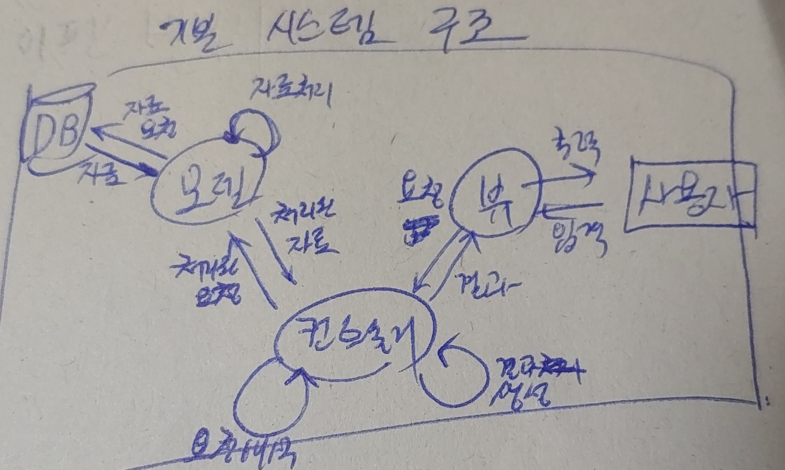

# OfficeAutomationSystem
NOVA 업무 자동화 시스템  
  
## 개요

이하 업무의 자동화 / 전산화 시스템 구축
1. 수주 목록 관리
2. 자재 목록 관리
3. 작업 지시서 작성
4. 재고 관리  
  
  
## 프로젝트 일정

2024.01 ~ 2024.03 - 작업지시서 생성기 구현  
2024.05 - 종합 시스템 구현  


## 기능명세


1. DB 내용 관리(검색, 입력, 수정, 삭제)
   - 분말
   - 다이아
   - 부재료
   - 샹크
   - 본드
   - 세그먼트
   - 제품
   - 제품 작업지시서
   - 세그먼트 작업지시서
   - 수주
   - 수주처
2. 작업 현황 보기(필터 뷰)
   - 현재 작업 보기
   - 출고일 등록
3. 제품 작업지시서 생성
4. 세그먼트 작업지시서 생성  


## MVC 구조




## DB 명세

seq, reg_date, update_date 관리용 공통항목 (노출x, 정렬x)  

db_name = nova_db  

|테이블명|용도|
|---:|:---|
|powder|분말|
|diamond|다이아|
|submeterial|부재료|
|shank|샹크|
|bond|본드|
|segment|세그먼트|
|item|제품|
|segment_production|세그먼트 제조지시서|
|item_production|제품 제조지시서|
|order|수주|
|client|수주처|

*각 테이블 명세 문서 작성 필요*

## 데이터 형식

V->C 동작 요청, C->M 데이터 요청  
``` python
request_format = { 
	'table_name',
	('S'|'I'|'U'|'D'),	#동작 (Select, Insert, Update, Delete)
	{'key':'value',}
}
```

M->C 데이터 반환, C->V 결과 반환  
``` python
response_format = { 
	['key',],		#표머리 
	{'key':'value',}
}
```

## 기타

- DB, table label: snake_case